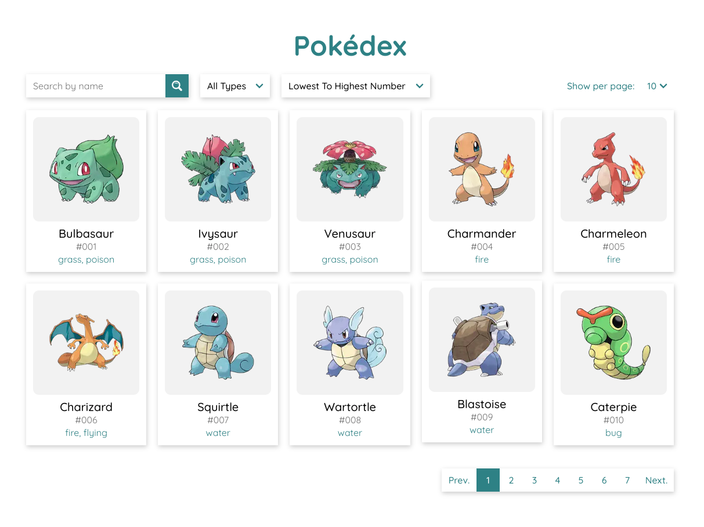

# Pokédex

Next.js app that displays Pokémon from the original Pokémon API ([pokeapi.co](https://www.pokeapi.co)) in a list with information about them.

## Features

- Pokémon cards list with pagination.
- Select the amount of cards to show per page (10/20/50).
- Filter Pokémon by name and type.
- Search for Pokémon.
- Sort Pokémon.
- View detailed information about Pokémon by clicking on it (stats, abilities, etc.).

## Technologies

- TypeScript
- Next.js
- React
- Redux
- SCSS
- ESLint

## Screenshot



## Demo

> https://pokedex.ednoram.vercel.app/

## Usage

> Clone the repository.

```bash
git clone https://github.com/ednoram/pokedex.git
```

> Run the following commands.

```bash
npm install && npm run dev
```

## Contact

Edward Noramirian

> GitHub: [@ednoram](https://github.com/ednoram)

> LinkedIn: [Edward Noramirian](https://www.linkedin.com/in/edward-noramirian)

> Email: e.noramirian@gmail.com
